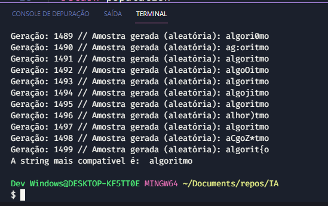

Um algoritmo genético é um algoritmo de busca inspirado na teoria de Darwin e Mendel. Esse algoritmo trabalha gerando cruzamento entre os melhores indivíduos de uma população para gerar uma população mais próxima do resultado esperado. 

A saída da implementação:

Mais sobre algoritmos genéticos:

* Introdução ao Algoritmo Genético - Parte 1: https://www.youtube.com/watch?v=xtHMSJLnKsE&t=20s
* Introdução ao Algoritmo Genético - Parte 2: https://www.youtube.com/watch?v=96mlWTAvjik
* [PyBR14] Algoritmo Genético com Python - Ana Paula Mendes: https://www.youtube.com/watch?v=PCa0koOOQnM&t=49s
